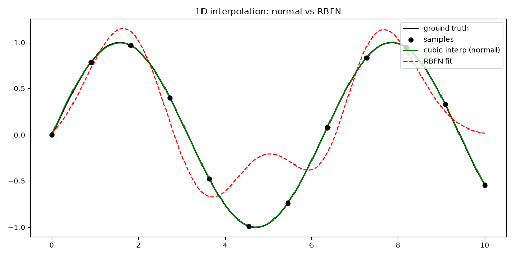
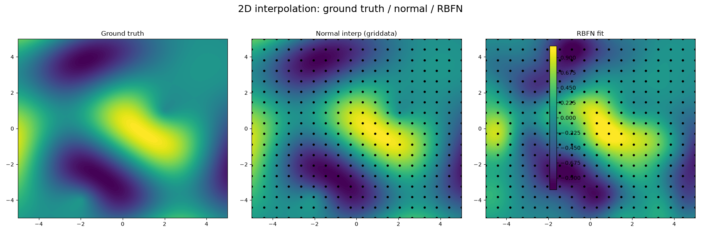
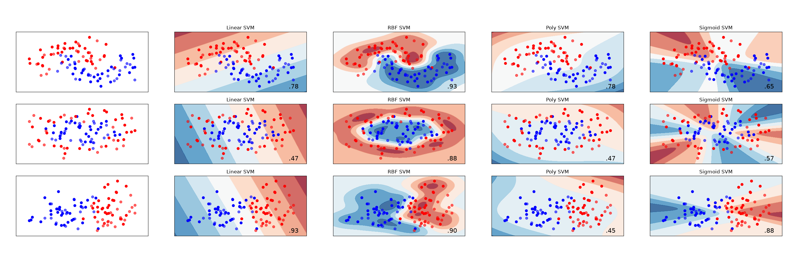

http://localhost:8000 

<br>
OUTPUTS:
          <br>
          <br>
          <br>
     
   

# RBFN Project

This repository contains Radial Basis Function Network code in Python, along with supporting scripts for evaluation and visualization.

## Project structure

- `accuracy.py` — run accuracy evaluation using a simple RBFN classifier on `bank-full.csv`
- `gradientDescent.py` — compare hill-climbing optimization with and without an RBFN
- `interpolation.py` — demonstrate 1D and 2D interpolation using `RBF1.py`
- `mainDEAP.py` — evolutionary optimization with DEAP and RBFN-based evaluation
- `viz.py` — classification decision-boundary visualizations using SVMs
- `RBF.py` / `RBF1.py` — RBF network implementations
- `docs/` — static web front-end for GitHub Pages

## Run locally

Activate the virtual environment and run Python scripts:

```bash
cd /home/jni/Documents/RBFN
.venv/bin/python accuracy.py
.venv/bin/python gradientDescent.py
.venv/bin/python interpolation.py
.venv/bin/python mainDEAP.py
.venv/bin/python viz.py
```


